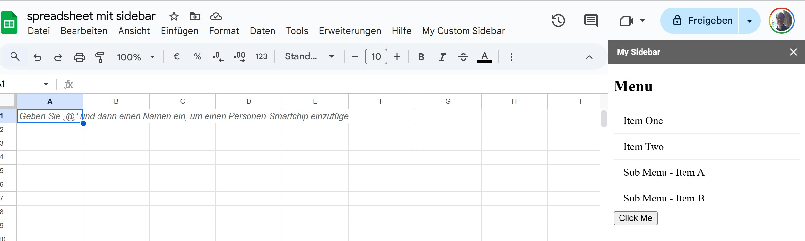

# Menüstrukturen in SpreadSheet einbetten

Sie können in Google Spreadsheets Menüs einbinden. Die Menüs können z.B. in Form einer Sidebar auf der rechten Seite des Spreadsheets angezeigt werden. Auf diese Art lassen sich anwendungsspezifische Menüs gestalten. 

## Sidebar für eine Spreadsheet

Erstellen Sie ein Spreadsheet und öffnen Sie unter Erweiterung den Apps Skript-Editor.

Im Skript-Editor legen Sie eine HTML-Seite für die Sidebar an. Diese kann z.B. `sidebar.html`heißen.  

```HTML
<!DOCTYPE html>
<html>
  <head>
    <base target="_top">
  </head>
  <body>
    <button onclick="google.script.run.meineFunktionInDerTabelle()">Klick mich!</button>
  </body>
</html>
```

In der HTML-Seite wird ein Button dargestellt. Bei Klicken auf den Button wird eine Funktion namens `meineFunktionInDerTabelle()` ausgeführt.  

Die zugehörigen Funktionsdefinitionen sind in eines *.gs Datei abzulegen; z.B. in Code.gs.

``` javascript
function onOpen() {
  SpreadsheetApp.getUi()
      .createMenu('Meine Anwendung')
      .addItem('Befehls-Seitenleiste öffnen', 'showSidebar')
      .addToUi();
}

function showSidebar() {
  var html = HtmlService.createHtmlOutputFromFile('sidebar')
      .setTitle('Funktionen der Anwendung')
      .setWidth(300);
  SpreadsheetApp.getUi().showSidebar(html);
}

function meineFunktionInDerTabelle() {
  SpreadsheetApp.getActiveSpreadsheet().toast('Dieser Text wurde von der Seitenleiste dargestellt!');
}
```

Die Funktion `onOpen()` wird getriggert, wenn das Spreadsheet geöffnet wird. Achtung: hier sind erweiterte Berechtigungen notwendig, die Sie dem Spreadsheet erteilen müssen.  
Die Funktion `showSidebar()`stellt die HTML-Seite als Sidebar dar.  

Die Funktion `meineFunktionInDer Tabelle()` erstellt einen Dialog, der in der Sidebar dargestellt wird.  

## Verbesserungsmöglichkeiten

Die Sidebar kann um Menüstrukturen ergänzt werden. Dazu werden i.d.R. Listen verwendet, wie im folgenden Beispiel dargestellt ist:

```html
<!DOCTYPE html>
<html>
<head>
  <title>My Sidebar Menu</title>
  <style>
    ul {
      list-style-type: none;
      padding: 0;
      margin: 0;
    }

    li a {
      display: block;
      padding: 10px 15px;
      text-decoration: none;
      color: black;
      border-bottom: 1px solid #eee;
    }

    li a:hover {
      background-color: #f0f0f0;
    }
  </style>
</head>
<body>
  <h2>Menu</h2>
  <ul>
    <li><a href="#" onclick="google.script.run.menuItem1Clicked()">Item One</a></li>
    <li><a href="#" onclick="google.script.run.menuItem2Clicked()">Item Two</a></li>
    <li><a href="#" onclick="google.script.run.subMenu.subItemClicked('A')">Sub Menu - Item A</a></li>
    <li><a href="#" onclick="google.script.run.subMenu.subItemClicked('B')">Sub Menu - Item B</a></li>
    <li><button onclick="google.script.run.buttonClicked()">Click Me</button></li>
    </ul>
</body>
</html>
```

Beachten Sie auch, dass hier Submenüs dargestellt werden. Allerdings entspricht dies nicht der Submenü-Logik in Spreadsheet-Menüs.

Der dazugehörige Funktionscode kann wie folgt aussehen (in Code.gs kopieren oder eigene *.gs-Datei anlegen):

```JavaScript
function onOpen() {
  SpreadsheetApp.getUi()
      .createMenu('My Custom Sidebar')
      .addItem('Open Sidebar', 'showSidebar')
      .addToUi();
}

function showSidebar() {
  var html = HtmlService.createHtmlOutputFromFile('sidebar')
      .setTitle('My Sidebar')
      .setWidth(300);
  SpreadsheetApp.getUi().showSidebar(html);
}

function menuItem1Clicked() {
  SpreadsheetApp.getActiveSpreadsheet().toast('Item One was clicked!');
  // Add your logic for what should happen when Item One is clicked
}

function menuItem2Clicked() {
  SpreadsheetApp.getActiveSpreadsheet().toast('Item Two was clicked!');
  // Add your logic for what should happen when Item Two is clicked
}

const subMenu = {
  subItemClicked: function(item) {
    SpreadsheetApp.getActiveSpreadsheet().toast('Sub Item ' + item + ' was clicked!');
    // Add your logic based on which sub-item was clicked
  }
};

function buttonClicked() {
  SpreadsheetApp.getActiveSpreadsheet().getRange('A1').setValue('Button Clicked!');
  // Add logic for the button click
}
```

Im obigen Code wird durch Klicken auf den Button der Wert in der Zelle A1 neu gesetzt. Dies zeigt, dass über die Sidebar ohne Probleme Wertänderungen möglich sind. Auch können andere Funktionen aufgerufen werden, die zur Datenerfassung geeignet sind.  

Das Ergebnis sieht dann wie folgt aus:  


## Verbesserungsmöglichkeiten - mit Datenerfassung

Im folgenden Beispiel ist eine Verbesserungsmöglichkeit dargestellt, wie über Menüs Werte eingefügt werden können. 
Dies greift natürlich zu kurz, da auch überprüft werden müsste, ob die Arbeit bereits existiert, bzw. der/die Studierende.

Das Spreadsheet muss zwei Sheets mit den Namen `Studierende` und `Arbeiten` enthalten.  

Der Funktionsteil in Code.gs muss folgende Elemente enthalten:

```javascript 
function onOpen() {
  SpreadsheetApp.getUi()
      .createMenu('Studentenverwaltung')
      .addItem('Sidebar öffnen', 'showSidebar')
      .addToUi();
}

function showSidebar() {
  var html = HtmlService.createHtmlOutputFromFile('sidebar')
      .setTitle('Studentenverwaltung')
      .setWidth(200); // Anpassung der Breite der Sidebar
  SpreadsheetApp.getUi().showSidebar(html);
}

function showStudentForm() {
  var htmlOutput = HtmlService.createHtmlOutputFromFile('student_form')
      .setWidth(350) // Breite des Dialogs anpassen
      .setHeight(300); // Höhe des Dialogs anpassen
  SpreadsheetApp.getUi().showModalDialog(htmlOutput, 'Studierendendaten eingeben');
}

function showThesisForm() {
  var htmlOutput = HtmlService.createHtmlOutputFromFile('thesis_form')
      .setWidth(350) // Breite des Dialogs anpassen
      .setHeight(300); // Höhe des Dialogs anpassen
  SpreadsheetApp.getUi().showModalDialog(htmlOutput, 'Wissenschaftliche Arbeit erfassen');
}

function saveStudentData(data) {
  var ss = SpreadsheetApp.getActiveSpreadsheet();
  var sheet = ss.getSheetByName('Studierende');
  if (!sheet) {
    SpreadsheetApp.getUi().alert('Das Sheet "Studierende" wurde nicht gefunden.');
    return;
  }
  sheet.appendRow([data.matrikelnummer, data.vorname, data.nachname, data.mail, data.studiengang]);
  SpreadsheetApp.getUi().alert('Studierendendaten erfolgreich gespeichert.');
}

function saveThesisData(data) {
  var ss = SpreadsheetApp.getActiveSpreadsheet();
  var sheet = ss.getSheetByName('Arbeiten');
  if (!sheet) {
    SpreadsheetApp.getUi().alert('Das Sheet "Arbeiten" wurde nicht gefunden.');
    return;
  }
  sheet.appendRow([data.matrikelnummer, data.titel, data.anfangsdatum, data.abgabedatum]);
  SpreadsheetApp.getUi().alert('Daten zur wissenschaftlichen Arbeit erfolgreich gespeichert.');
}
```

Es sind drei HTML-Dateien anzulegen:

`sidebar.html`

```HTML
<!DOCTYPE html>
<html>
<head>
  <base target="_top">
  <style>
    body {
      font-family: sans-serif;
    }
    ul {
      list-style-type: none;
      padding: 0;
      margin: 0;
    }
    li a {
      display: block;
      padding: 10px 15px;
      text-decoration: none;
      color: black;
      border-bottom: 1px solid #eee;
      cursor: pointer;
    }
    li a:hover {
      background-color: #f0f0f0;
    }
    h2 {
      margin-top: 0;
      padding-left: 15px;
    }
  </style>
</head>
<body>
  <h2>Aktionen</h2>
  <ul>
    <li><a onclick="google.script.run.showStudentForm()">Eingabe Studierendendaten</a></li>
    <li><a onclick="google.script.run.showThesisForm()">Eingabe wissenschaftliche Arbeit</a></li>
  </ul>
</body>
</html>
```

`student_form.html`

```HTML
<!DOCTYPE html>
<html>
<head>
  <base target="_top">
  <style>
    body {
      font-family: sans-serif;
      padding: 15px;
    }
    label {
      display: block;
      margin-bottom: 5px;
    }
    input[type="text"],
    button {
      width: 100%;
      padding: 8px;
      margin-bottom: 10px;
      box-sizing: border-box;
      border: 1px solid #ccc;
      border-radius: 4px;
    }
    button {
      background-color: #008CBA;
      color: white;
      border: none;
      cursor: pointer;
      font-size: 14px;
    }
    button:hover {
      background-color: #0077a3;
    }
  </style>
</head>
<body>
  <h3>Studierendendaten eingeben</h3>
  <label for="matrikelnummer">Matrikelnummer:</label><br>
  <input type="text" id="matrikelnummer" name="matrikelnummer"><br>

  <label for="vorname">Vorname:</label><br>
  <input type="text" id="vorname" name="vorname"><br>

  <label for="nachname">Nachname:</label><br>
  <input type="text" id="nachname" name="nachname"><br>

  <label for="mail">E-Mail:</label><br>
  <input type="text" id="mail" name="mail"><br>

  <label for="studiengang">Studiengang:</label><br>
  <input type="text" id="studiengang" name="studiengang"><br>

  <button onclick="submitStudentForm()">Speichern</button>

  <script>
    function submitStudentForm() {
      var data = {
        matrikelnummer: document.getElementById('matrikelnummer').value,
        vorname: document.getElementById('vorname').value,
        nachname: document.getElementById('nachname').value,
        mail: document.getElementById('mail').value,
        studiengang: document.getElementById('studiengang').value
      };
      google.script.run.withSuccessHandler(closeForm).withFailureHandler(showError).saveStudentData(data);
    }

    function closeForm() {
      google.script.host.close();
    }

    function showError(error) {
      alert('Fehler beim Speichern der Daten: ' + error);
    }
  </script>
</body>
</html>
```

Und `thesis_form.html`

```HTML
<!DOCTYPE html>
<html>
<head>
  <base target="_top">
  <style>
    body {
      font-family: sans-serif;
      padding: 15px;
    }
    label {
      display: block;
      margin-bottom: 5px;
    }
    input[type="text"],
    button {
      width: 100%;
      padding: 8px;
      margin-bottom: 10px;
      box-sizing: border-box;
      border: 1px solid #ccc;
      border-radius: 4px;
    }
    button {
      background-color: #008CBA;
      color: white;
      border: none;
      cursor: pointer;
      font-size: 14px;
    }
    button:hover {
      background-color: #0077a3;
    }
  </style>
</head>
<body>
  <h3>Wissenschaftliche Arbeit erfassen</h3>
  <label for="matrikelnummer">Matrikelnummer des Studierenden:</label><br>
  <input type="text" id="matrikelnummer" name="matrikelnummer"><br>

  <label for="titel">Titel der Arbeit:</label><br>
  <input type="text" id="titel" name="titel"><br>

  <label for="anfangsdatum">Anfangsdatum (JJJJ-MM-TT):</label><br>
  <input type="text" id="anfangsdatum" name="anfangsdatum"><br>

  <label for="abgabedatum">Abgabedatum (JJJJ-MM-TT):</label><br>
  <input type="text" id="abgabedatum" name="abgabedatum"><br>

  <button onclick="submitThesisForm()">Speichern</button>

  <script>
    function submitThesisForm() {
      var data = {
        matrikelnummer: document.getElementById('matrikelnummer').value,
        titel: document.getElementById('titel').value,
        anfangsdatum: document.getElementById('anfangsdatum').value,
        abgabedatum: document.getElementById('abgabedatum').value
      };
      google.script.run.withSuccessHandler(closeForm).withFailureHandler(showError).saveThesisData(data);
    }

    function closeForm() {
      google.script.host.close();
    }

    function showError(error) {
      alert('Fehler beim Speichern der Daten: ' + error);
    }
  </script>
</body>
</html>
```
