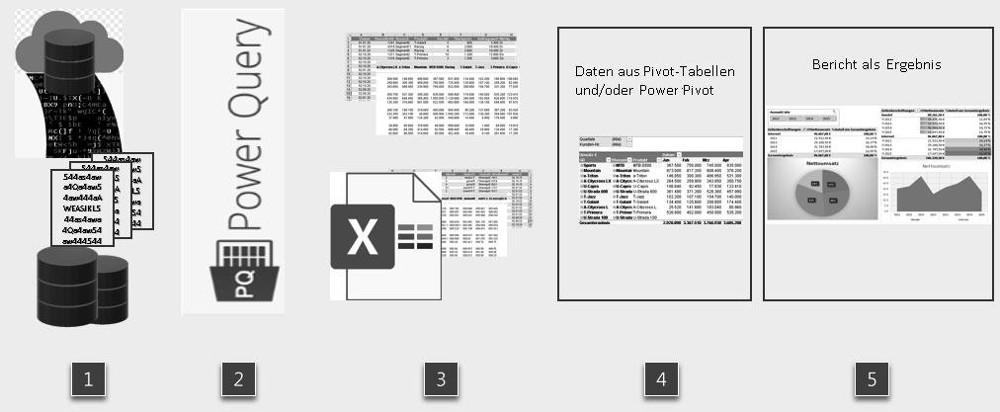

# Pivot-Tabellen in MS Excel  

## PivotTables und Excel zur Datenverarbeitung

Ein sehr gutes, umfangreiches Buch zur Arbeit mit Pivot-Tabellen ist das folgende:

> _Schuster, Helmut (2021)_: Microsoft Excel Pivot-Tabellen - Ideen und Lösungen für die Datenanalyse mit PivotTables und PivotCharts sowie intensibem Einstieg in Power Pivot - für Version 2013, 2016, 2019 & 365, O'Reilly, 2. Aufl., 2021

Das Buch finden Sie online in der Bibliothek der Frankfurt University of Applied Sciences unter folgendem Link:
https://hds.hebis.de/fuas/Record/HEB474948528

> Für den Zugang zum Bcuh ist die Verwendung des VPNs notwendig.

Die Übungsdateien zum Buch finden Sie unter dem Tab "Zusatzmaterial" auf der [Verlagsseite](https://dpunkt.de/produkt/microsoft-excel-pivot-tabellen-das-praxisbuch/).  

Schuster beschreibt in seinem Buch den kompletten Workflow.  

> Abb. aus Schuster (2021), S.4: Schematischer Aufbau des Lösungswegs

Die Schritte sind die folgenden:

1) Laden der Daten (Textdateien oder andere Formate)
2) Aufbereitung mittels Power Query
3) Alternativ Erfassung von Daten direkt in Excel
4) Verarbeitung in einem Lösungsmodell (z.B. Pivot-Tabellen oder Power-Pivot-Datenmodell)
5) Ausgabe / Weitergabe als Report

## Grundsätzliches zu PivotTables

### Funktionalität  

* Filterung, Selektion, Umgestaltung und Auswertung von Daten
* Darstellung in Form von PivotCharts

### Definition

"_[Eine] PivotTable ist eine interaktive Tabelle, in der sich Daten in einer oder mehreren Gruppen zusammenfassen lassen. Jede Spalte in den Basisdaten wird mit ihrer Bezeichnung in der ersten, obersten Zelle in der PivotTable zu einem Feld. Gruppen entstehen unter Verwendung mathematischer Funktionen wie beispielsweise Summe oder Anzahl._" (Schuster 2021), S. 7  

## Voraussetzungen für die Verwendung von PivotTables

* Spalte müssen Überschriften haben
* Der Datenbereich enthält mindesten 2 Zeilen
* Keine leeren Spalten und/oder Zeilen
* Datumsspalten müssen immer komplett mit Datumswerten gefüllt sein.  
* In der Basistabelle dürfen keine Berechnungen mit Zwischensummen enthalten sein.
* Berechnete Spalten sind möglich.
* Best Case: dynamische Quellbereich einer PivotTable werden auch über "intelligente Tabellen" der PivotTable bereitgestellt. Dies hat Vorteile, wenn die Datenbasis um Zeilen erweitert wird.
* Ausgeblendete Zeilen und Spalten werden in der PivotTable mit in die Berechnungen einbezogen
(Schuster 2021), S. 7-8

