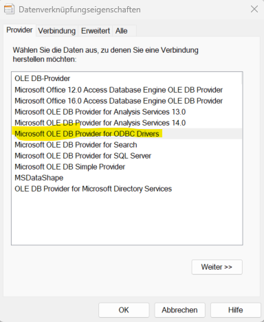

 # MySQL und PowerPivot
 
 Ein Video, das die Verbindung von Excel mit MySQL erklärt, ist z.B. das folgende Video von TeachExcel
  

## Installation des ODBC-Treibers

Verwenden Sie bitte den entsprechenden Treiber für Ihre MySQL-Version. 

Da Ihre Excel-Version und Windows-Version wahrscheinlich eine 64bit-Version ist, installieren Sie bitte auch einen 64bit-Treiber für MySQL.  
Falls Sie diesen nicht finden, navigieren Sie bitte zum "Archive" der Treiber. 

Sie benötigen den [>>ODBC-Treiber für MySQL](https://dev.mysql.com/downloads/connector/odbc/) für Ihr Betriebssystem. Installieren Sie bitte die letztaktuelle stabile Version des Treibers.  
Hinweis für Mac-User: [Excel für Mac - kompatible ODBC-Treiber](https://support.microsoft.com/de-de/office/mit-excel-f%C3%BCr-mac-kompatible-odbc-treiber-9fa6bc7f-d19e-4f7f-9be4-92e85c77d712#:~:text=Wenn%20Sie%20Daten%20aus%20einer%20Datenbank%20nach%20Excel,f%C3%BCr%20Excel%202019%20und%20Microsoft%20365%20f%C3%BCr%20Mac.)

## Einrichtung des Treibers zur Verbindung mit einer Datenbank

Die folgenden Ausführungen orientieren sich an Windows:

Suchen Sie in der Windows-Eingabezeile (unten links neben dem Windows-Symbol) nach "ODBC" und öffnen Sie die ODBC-Treiber-Verwaltungssoftware.

Erstellen Sie sich dort eine neue Benutzer-DSN. Klicken Sie rechts auf "Hinzufügen". Wählen Sie bei der Erstellung den "ANSI-Treiber" aus.  

Vergeben Sie einen neuen Namen für die Datenquelle und wählen Sie als Server die IP-Adresse 127.0.0.1 aus. Der User ist "root", sofern Sie lokal mit root arbeiten. 

Eine ODBC-Quelle für eine Datebank eines Kindergartens sähe beispielsweise so aus:

Klicken Sie auf "Test", um zu bestätigen, dass die Verbindung funktioniert. 

Bestätigen Sie am Ende die Einrichtung mit "OK".
Sie sollten die Datenquelle nun in der Übersicht sehen:

## Verbindung mit der Datenquelle in PowerPivot

In PowerPivot klicken Sie auf "Verwalten".  

Wählen Sie nun "aus anderen Quellen"  

und im sich öffnenden Fenster den Eintrag zu ODBC:

Nun "erstellen" Sie eine Datenverbindung 

Gehen Sie auf den "Provider"-Tab und wählen Sie dort 

Nun wechseln Sie auf den Tab "Verbindung" und wählen die von Ihnen erstellte Quelle im Dropdown und erfassen dann User und Kennwort. Anschließend wählen Sie im 3. Punkt Ihre Datenbank.

Testen Sie nun Ihre Verbindung. 

Setzen Sie nun den Verbindungsnamen, so dass Sie die Datenbank in PowerPivot identifizieren können.

Testen Sie erneut die Verbindung.  

Sie können nun Tabellen und andere Objekte der Datenbank aus einer Liste für den Import auswählen oder eine Abfrage erstellen. 
