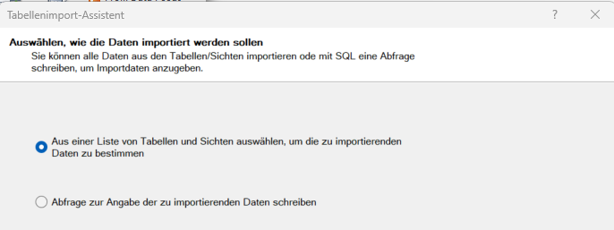
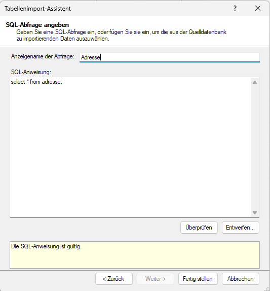
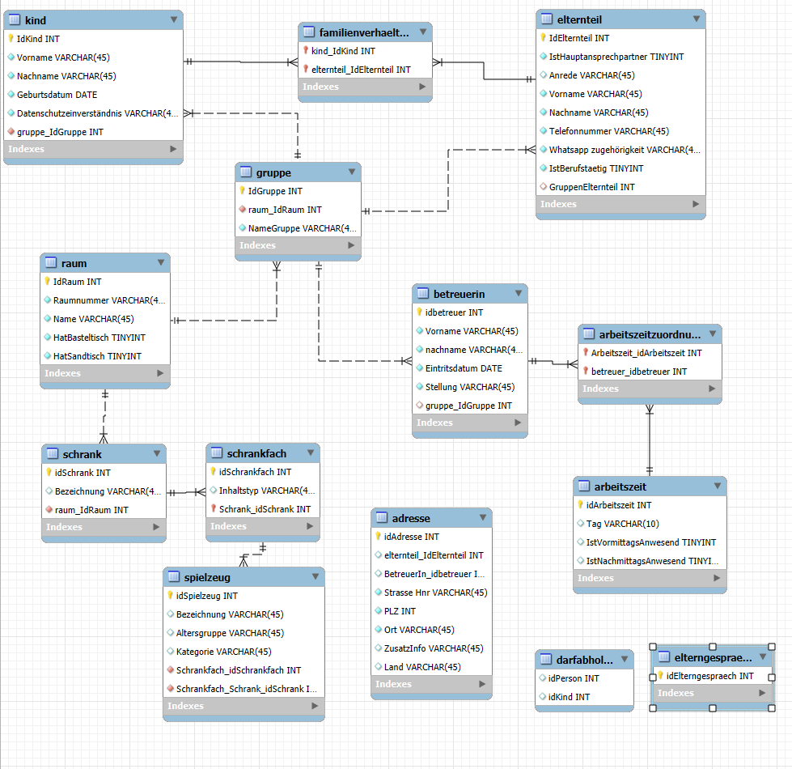
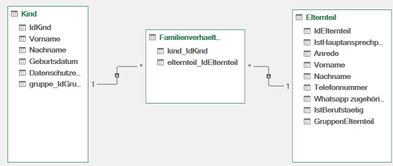
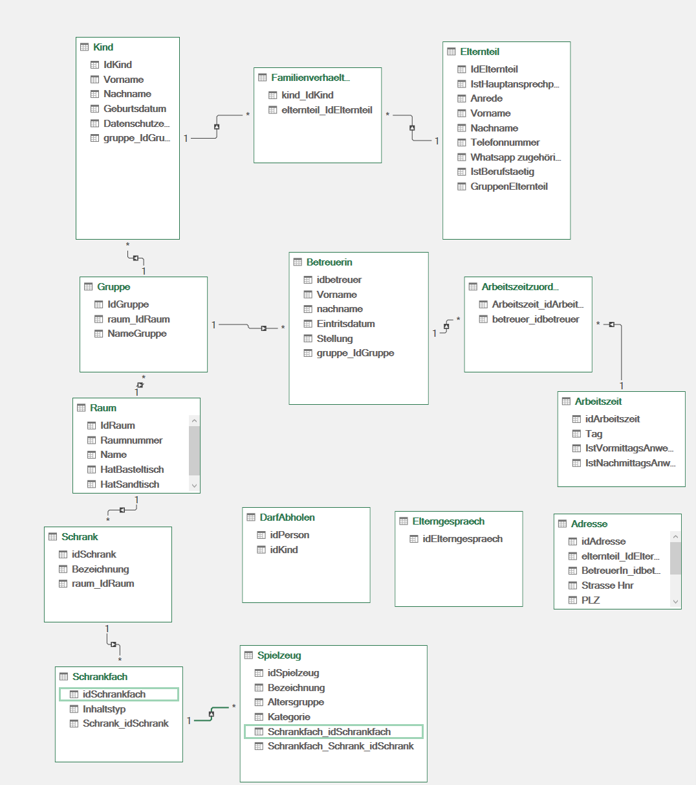

# Daten aus MySQL in PowerPivot laden 

## Auswahl von Tabellen

Leider ist die Verbindung zwischen MySQL über die Auswahl von Tabellen fehlerhaft. Es kann sein, dass Sie in einen SQL-Fehler laufen. Dieser deutet dann darauf hin, dass es Probleme mit der von PowerPivot erstellten SQL-Befehle gibt, da diese eckige Klammern zur Benennung der Tabellennamen verwenden.  

Das Problem ist auf stackoverflow beschrieben: [mysq-odbc-import-fail](https://stackoverflow.com/questions/8153984/mysql-odbc-import-fail)



Wir wählen daher keine Tabellen aus, sondern verfassen jeweils pro Tabelle einen SQL-Befehl, um die Tabellen zu laden. Das ist mühsam, funktioniert jedoch.  

Ein Beispiel für die Tabelle namens "adresse"

Setzen Sie im Anzeigenamen den Tabellennamen.  

Anbei alle Statements zum Laden der Tabellen:

```SQL
select * from adresse;
select * from arbeitszeit;
select * from arbeitszeitzuordnung;
select * from betreuerin;
select * from darfabholen;
select * from elterngespraech;
select * from elternteil;
select * from familienverhaeltnis;
select * from gruppe;
select * from kind;
select * from raum;
select * from schrank;
select * from schrankfach;
select * from spielzeug;
```

Sie können diese nun vereinfacht über "vorhandene Datenbankverbindungen" --> Kindergarten --> Doppelklick eingeben.  

Für jede Tabelle sollten Sie nun ein Tab sehen.  

## Erstellen eines ER-Diagramms

Wir erstellen im nächsten Schritt ein Entity-Relationship-Diagramm.

* Gehen Sie dazu in die "Diagrammansicht".  
* Dort sehen Sie hintereinander die einzelnen Tabs als Tabellen dargestellt.  
* Es fehlen noch die Beziehungen zwischen den Tabellen.  
* Ein Modell ist wichtig, da es die Auswertungen später erheblich vereinfacht.  

_Hinweis: I.d.R. - sofern nicht per SQL importiert wird - kann Power Pivot die Beziehungen auch aus dem Datenmodell herleiten._  

Sie können sich bei der Erstellung am ER-Modell der MySQL-Workbench orientieren.  



### Erstellung einer Beziehung in PowerPivot

Wir weredn nun in PowerPivot in der Diagrammansicht Beziehungen zwischen Elternteil und Kind anlegen. Die Beziehung ist eine m:n-Beziehung, die durch zwei 1:n-Beziehungen uber Familienverhaeltnis abgebildet wird.  
Gehen Sie wie folgt vor:

1) Drücken Sie mit der linken Maustaste auf kind_IdKind in "Familienverhaeltnis" und ziehen Sie die Maus auf IdKind in "Kind". Sie haben nun eine 1:n-Beziehung zwischen Kind und Familienverhaeltnis erstellt.  
2) Drücken Sie mit der linken Maustaste elternteil_IdElternteil in "Familienverhaeltnis" und ziehen Sie die Maus auf IdElternteil in "Elternteil". Sie haben nun eine 1:n-Beziehung zwischen Elternteil und Familienverhaeltnis erstellt.  



Das entstehende Datenmodell entspricht fast eins zu eins dem Workbench-Modell. Allerdings läst sich die identifizierened Beziehung zwischen Spielzeug und Schrankfach nicht korrekt abbilden.  



