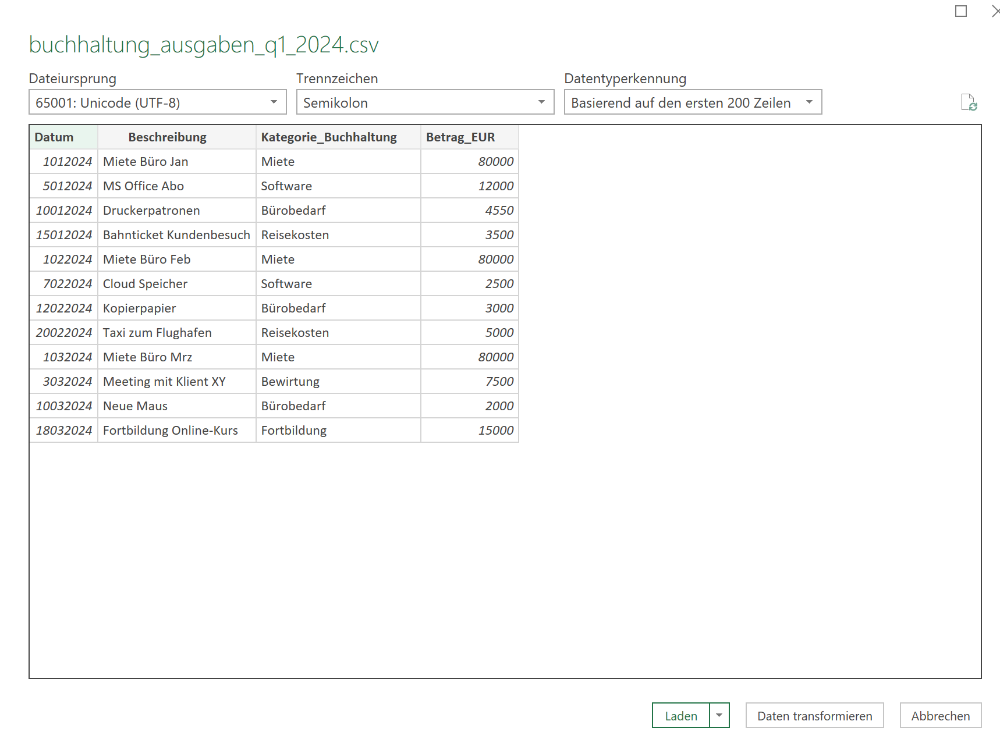

# Fallstudie: Steuerliche Datenanalyse für Kleinunternehmer

## 1) Einleitung / Szenario

### Szenario

Herr Paul Meier ist ein selbstständiger IT-Berater und Kleinunternehmer. Für das erste Quartal des Geschäftsjahres 2024 (Januar bis März) hat er seine Geschäftsausgaben in einer einfachen Buchhaltungssoftware erfasst. Nun möchte er seinen Jahresabschluss vorbereiten und die erfassten Ausgaben mit seinen Banktransaktionen abgleichen, um sicherzustellen, dass alle relevanten Ausgaben korrekt erfasst und keine möglichen Abzüge vergessen wurden. Außerdem möchte er einen Überblick über seine Einnahmen und Ausgaben pro Kategorie und Monat erhalten.

Die Daten aus der Buchhaltungssoftware liegen als CSV-Export vor und enthalten nur Ausgaben. Die Banktransaktionen liegen als Excel-Export vor und enthalten sowohl Abbuchungen (Ausgaben) als auch Gutschriften (Einnahmen). Die Kategorisierung in der Buchhaltungssoftware und die Beschreibungen in den Banktransaktionen sind nicht immer identisch, und es gibt Transaktionen in der Bank, die nicht in der Buchhaltung erfasst wurden (und umgekehrt).

## 2) Lernziele

Nach Bearbeitung dieser Fallstudie können Sie:

* Daten aus verschiedenen Quellen (CSV, Excel) in Excel Power Query laden.
* einfache Datenbereinigungs- und Transformationsschritte in Power Query ausführen (Datentypen anpassen, Spalten umbenennen, neue Spalten berechnen, bedingte Logik anwenden).
* Daten basierend auf Textinhalten kategorisieren.
* Daten aus unterschiedlichen Quellen konsolidieren.
* Pivot-Tabellen und Pivot-Charts zur Analyse von Finanzdaten erstellen.
* Diskrepanzen zwischen verschiedenen Datenquellen identifizieren

Bereitgestellte Daten:

[Bank-Transaktionen](bank_transaktionen_q1_2024.xlsx)
[Export aus Buchhaltungssoftware](buchhaltung_ausgaben_q1_2024.csv)

## 3) Daten laden und transformieren in Power Query

### Starten des Power Query Editor

* Erstellen Sie eine Excel-Datei mit dem Namen `Übung_ETL.xlsx`
* Öffnen Sie ein leeres Excel-Arbeitsblatt.
* Gehen Sie zu `Daten > Daten abrufen > Aus Datei > Aus Excel-Arbeitsmappe` (für die folgende Excel-Datei) bzw. `Aus Text/CSV` (für die CSV-Datei).  

### Laden und Transformieren der buchhaltung_ausgaben_q1_2024.csv

* Laden Sie die CSV-Datei wie oben beschrieben und klicken Sie dann auf `Daten transformieren`.


* Datentypen anpassen: Stellen Sie sicher, dass Datum als Datum und Betrag_EUR als Dezimalzahl erkannt werden. Klicken Sie oben links auf den Datentyp und ändern Sie diesen. Bestätigen Sie mit `Aktuelle ersetzen`


* Spalten umbenennen: Benennen Sie die Spalten um für Konsistenz:
  * Datum -> Transaktionsdatum
  * Beschreibung -> Details
  * Kategorie_Buchhaltung -> Kategorie
  * Betrag_EUR -> Betrag


* Neue Spalte 'Quelle' hinzufügen: Fügen Sie eine benutzerdefinierte Spalte namens Quelle hinzu, die den Wert "Buchhaltung" enthält.


* Neue Spalte 'Typ' hinzufügen: Fügen Sie eine benutzerdefinierte Spalte namens Typ hinzu, die den Wert "Ausgabe" enthält (da diese Datei nur Ausgaben enthält).

* Betrag vereinheitlichen: Stellen Sie sicher, dass alle Beträge positive Zahlen sind (da es sich um Ausgaben handelt). Wenn ein Betrag negativ ist, multiplizieren Sie ihn mit -1. Dies ist aktuell nicht notwendig. Eine Einführung in die Sprache M finden Sie z.B. unter: <https://learn.microsoft.com/en-us/powerquery-m/m-spec-introduction>

Das Ergebnis sollte nun so aussehen:


Klicken Sie nun im Power Query-Editor auf `Schließen und Laden`.  

### Laden und Transformieren der bank_transaktionen_q1_2024.xlsx

* Laden Sie die Excel-Datei.
* Datentypen anpassen: Stellen Sie sicher, dass Transaktionsdatum als Datum und Abbuchung_EUR sowie Gutschrift_EUR als Dezimalzahl erkannt werden.
* 'Betrag'-Spalte erstellen: Fügen Sie eine benutzerdefinierte Spalte namens Betrag hinzu, die die Werte aus Abbuchung_EUR und Gutschrift_EUR kombiniert:
  * Wenn Abbuchung_EUR einen Wert hat, soll der Betrag -Abbuchung_EUR sein (negativ für Ausgaben).
  * Wenn Gutschrift_EUR einen Wert hat, soll der Betrag Gutschrift_EUR sein (positiv für Einnahmen).
  * (Tipp: Verwenden Sie eine bedingte Spalte oder eine If-Anweisung in Power Query M-Sprache).

```M
= Table.AddColumn(#"Geänderter Typ", "Betrag", each if [Abbuchung_EUR] <> null then -[Abbuchung_EUR]
else if [Gutschrift_EUR] <> null then [Gutschrift_EUR]
else 0)
```


* Neue Spalte 'Quelle' hinzufügen: Fügen Sie eine benutzerdefinierte Spalte namens Quelle hinzu, die den Wert "Bank" enthält.
* Neue Spalte 'Typ' hinzufügen: Fügen Sie eine benutzerdefinierte Spalte namens Typ hinzu:
  * Wenn Abbuchung_EUR einen Wert hat, soll der Typ "Ausgabe" sein.
  * Wenn Gutschrift_EUR einen Wert hat, soll der Typ "Einnahme" sein.


* Neue Spalte 'Kategorie' hinzufügen (Herausforderung!): Fügen Sie eine benutzerdefinierte Spalte namens Kategorie hinzu. Diese soll die Transaktionen basierend auf dem Details-Text einer Kategorie zuordnen. Wenn keine Kategorie erkannt wird, verwenden Sie "Sonstiges" oder "Unbekannt".
  * Beispiele für Kategorisierungsregeln:
    * Wenn Details "Miete" enthält -> "Miete"
    * Wenn Details "Microsoft" oder "Cloud" enthält -> "Software"
    * Wenn Details "Büro" oder "Papier" oder "Elektrofachmarkt" enthält -> "Bürobedarf"
    * Wenn Details "DB Ticket" oder "Taxi" oder "Parkgebühren" enthält -> "Reisekosten" * Wenn Details "Restaurant Meeting" enthält -> "Bewirtung"
    * Wenn Details "Online Kurs" enthält -> "Fortbildung"
    * Wenn Details "Honorar Kunde" enthält -> "Einnahmen" (wenn der Typ "Einnahme" ist, ansonsten ignorieren).
  * (Tipp: Verwenden Sie mehrere "Bedingte Spalten" oder eine geschachtelte If-Anweisung in der M-Sprache).


```M
 if Text.Contains([Details], "Miete") then "Miete"
else if Text.Contains([Details], "Microsoft") or Text.Contains([Details], "Cloud") then "Software"
else if Text.Contains([Details], "Büromaterial") or Text.Contains([Details], "Papier") or Text.Contains([Details], "Elektrofachmarkt") then "Bürobedarf"
else if Text.Contains([Details], "DB Ticket") or Text.Contains([Details], "Taxi") or Text.Contains([Details], "Parkgebühren") then "Reisekosten"
else if Text.Contains([Details], "Restaurant Meeting") then "Bewirtung"
else if Text.Contains([Details], "Online Kurs") then "Fortbildung"
else if Text.Contains([Details], "Honorar Kunde") then "Einnahmen" // Dies ist die Einnahmen-Kategorie
else "Sonstiges" // Standardwert, wenn keine der Bedingungen zutrifft
```

* Unnötige Spalten entfernen: Entfernen Sie die Spalten Abbuchung_EUR und Gutschrift_EUR.

### Daten konsolidieren

* Verwenden Sie Abfragen anfügen (Append Queries) im Power Query Editor.

* Fügen Sie die transformierte Bank-Transaktionen-Tabelle an die transformierte Buchhaltungs-Ausgaben-Tabelle an. Nennen Sie die neue Abfrage `Konsolidierte_Transaktionen`. Verwenden Sie dazu "Abfragen als neu anfügen".  


* Stellen Sie sicher, dass Transaktionsdatum und Betrag korrekt formatiert sind (Datum bzw. Dezimalzahl).

### Laden der Daten

* Klicken Sie auf Schließen & laden > Schließen & laden in... > Nur Verbindung erstellen. (Dies ist besser, da die Daten direkt in das Datenmodell geladen werden).
* Rechtsklicken Sie im Abfragebereich auf Konsolidierte_Transaktionen und wählen Sie Laden in... > Nur Verbindung erstellen. Dies lädt die Daten ins Power Pivot Datenmodell.


## 4) Report erstellen mit Pivot-Charts

Verwenden Sie die geladenen Konsolidierte_Transaktionen im Datenmodell, um die folgenden Pivot-Charts zu erstellen:

### Monatliche Entwicklung der Einnahmen und Ausgaben nach Quelle

* Erstellen Sie eine Pivot-Tabelle basierend auf Konsolidierte_Transaktionen. Verwenden Sie dazu "Empfohlene PivotTabellen"
* Ziehen Sie Transaktionsdatum in die Zeilen und gruppieren Sie es nach Jahren und Monaten.
* Ziehen Sie Quelle in die Spalten.
* Ziehen Sie Betrag in die Werte (Summe).
* Fügen Sie einen Slicer für Typ hinzu (filterbar auf "Einnahme" oder "Ausgabe").
  * Schritt-für-Schritt-Anleitung:
    * Wählen Sie eine Zelle innerhalb Ihrer Pivot-Tabelle aus.
    * Das ist wichtig, da die Registerkarten "PivotTable-Analyse" (oder "PivotTable-Tools") und "Einfügen" nur dann sichtbar werden.
    * Gehen Sie zur Registerkarte "PivotTable-Analyse" (oder "Analysieren" bei älteren Excel-Versionen) im Menüband.
    * Klicken Sie in der Gruppe "Filtern" auf "Datenschnitt einfügen" (oder "Slicer einfügen").

* Erstellen Sie ein Gruppiertes Säulendiagramm (oder Liniendiagramm), das die monatlichen Einnahmen/Ausgaben pro Quelle (Bank vs. Buchhaltung) visualisiert.


Achtung, die obige Darstellung ist noch falsch, weil die Ausgaben in einer der beiden Ursprungsdateien nicht auf negative Werte umgestellt wurden.

### Vergleich der Ausgabenkategorien nach Quelle

* Erstellen Sie eine neue Pivot-Tabelle.
* Ziehen Sie Kategorie in die Zeilen.
* Ziehen Sie Quelle in die Spalten.
* Ziehen Sie Betrag in die Werte (Summe). Stellen Sie sicher, dass es nur Ausgaben sind (Slicer Typ auf "Ausgabe" setzen).
* Erstellen Sie ein Gruppiertes Säulendiagramm oder ein Balkendiagramm, um die Ausgaben pro Kategorie aus der Buchhaltung und von der Bank gegenüberzustellen.

### Top-Ausgabenkategorien gesamt

* Erstellen Sie eine neue Pivot-Tabelle.
* Ziehen Sie Kategorie in die Zeilen.
* Ziehen Sie Betrag in die Werte (Summe). Stellen Sie sicher, dass es nur Ausgaben sind (Slicer Typ auf "Ausgabe" setzen).
Wenden Sie einen Wertfilter auf Kategorie an, um z.B. die Top 5 oder Top 10 Kategorien anzuzeigen.
*Erstellen Sie ein Säulendiagramm oder Balkendiagramm.

## 5) Fragen zur Analyse und Reflexion

Nachdem Sie die Pivot-Tabellen und -Charts erstellt haben, beantworten Sie folgende Fragen:

* Identifizieren Sie Transaktionen, die in den Bankdaten auftauchen, aber nicht in den Buchhaltungsdaten oder umgekehrt.  
* Gibt es Kategorien, bei denen die Ausgaben zwischen Buchhaltung und Bank stark voneinander abweichen? Nennen Sie ein Beispiel und überlegen Sie, woran das liegen könnte.
* Betrachten Sie die Kategorie-Spalte, die Sie in Power Query erstellt haben. Wie robust ist Ihre Kategorisierungslogik? Welche Herausforderungen gab es bei der Zuordnung von Banktransaktionen zu Kategorien, und wie könnten Sie diese verbessern?
* Welchen Vorteil bietet die Konsolidierung von Daten aus verschiedenen Quellen für die Erstellung eines Jahresabschlusses und die Steuererklärung?
