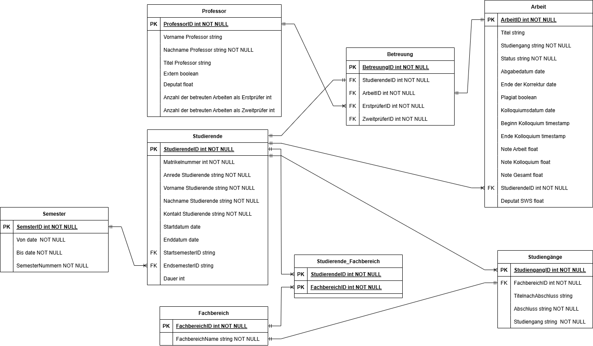

# Datenmodelle

Hinweis: Sie finden das vom Dozenten entwickelte Datenmodell (MySQL) hier: [Link](prof-is.sql)

Datenmodell von Crone:

Datenmodell von Gimbel et al:

Excel-Dateien

* [Von Gimbel](./Gimbel_et_al_normalisierte_tabellen_mit_datenkatalog.xlsx)
* [Von Crone](Crone_data_catalog_V04.xlsx)  

Folgende Punkte urden von anderen Studierenden geäußert:

## Datenmodell "Crone"

* FB-Prüfer in M:N umwandeln
* Studenten  --> MAtrikelnummer als PK
* Gruppenarbeit? M:N
* Deputat: unklar
* Fachbereich --> welches Attribut als ID? --> 1 Attribut überflüssig
* Studiengang --> Beschreibung unwichtig für App
* Prüfungen --> Notenzusammensetzung zu Endnote? --> Noten trennen (Erstprüfer, Zweitprüfer, Arbeit, Kolloquium)
* Deputat umbenennen in Deputatsberechnungsregel

## Datenmodell "Gimbel"

* Professor --> umbenennen in Prüfungsberechtigte
* Professor --> Anzahl der Arbeiten ist überflüssig (wird ja berechnet)
* Professor --> Mail / Kontakt
* Professor --> eine Beziehung zu Betreuung fehlt (entweder für Erst- oder Zweitkorrektor)
* Arbeit-Studierende --> M:N 
* FK-Beziehung zwischen Arbeit und Studiengang wünschenswert
* Attribute Startdatum und Enddatum gehören zur Arbeit und nicht zum Studierenden
