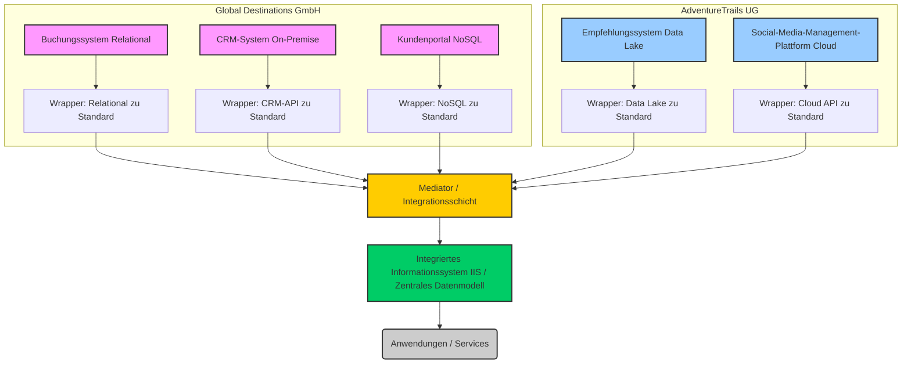

# LÖSUNG zur Übungsklausur: Datenintegration

---

## Teil A: Wissensfragen (20P)

1. **Die Bedeutung der Datenintegration** (4P)

* **Warum wichtig:** Moderne Unternehmen nutzen eine Vielzahl unterschiedlicher IT-Systeme (z.B. ERP, CRM, Webshop, Spezialsysteme), die oft isoliert voneinander entwickelt wurden. Für effiziente Geschäftsprozesse, einheitliche Kundensichten, Reporting und die Hebung von Synergien (z.B. bei Fusionen) ist es jedoch essenziell, dass diese Systeme Daten nahtlos austauschen können. Ohne Integration entstehen Datensilos, redundante Datenhaltung, Inkonsistenzen und ineffiziente manuelle Prozesse.

Zwei Kernziele der B2B-Integration:

* **Mapping der Darstellung und Bedeutung von Daten:** Datenformate, Strukturen und Bedeutungen unterscheiden sich oft zwischen Systemen. Ein Kernziel ist es, diese Unterschiede aufzulösen, sodass Daten aus System A von System B korrekt verstanden und verarbeitet werden können (z.B. Umwandlung eines Datumsformats oder die Zuordnung von Kunden-IDs).
* **Einheitlicher Zugriff auf Geschäftsdaten:** Ziel ist es, Anwendungen und Benutzern einen konsistenten und transparenten Zugriff auf relevante Geschäftsdaten zu ermöglichen, unabhängig davon, in welchem Backend-System die Daten ursprünglich gespeichert sind.

2. **Integrationsansätze im Vergleich** (6P)

Point-to-Point Integration:

* **Beschreibung:** Bei dieser Methode werden Backendsysteme paarweise direkt miteinander verbunden. Jede Verbindung wird durch spezielle Integrationssoftware oder -skripte realisiert, die Extraktion, Transformation und Laden (ETL) der Daten übernehmen.
* **Vorteil:** Relativ einfach für eine geringe Anzahl von Systemen (zwei) zu implementieren. Direkte Kontrolle über die jeweilige Verbindung.
* **Nachteil:** Hohe Komplexität und Skalierungsprobleme bei vielen Systemen (N^2 Verbindungen bei N Systemen). Jede neue Anwendung erfordert zwei neue Datenübertragungsverbindungen (in/out) und neue Transformationsschritte. Wartung und Fehlerbehebung werden schnell unübersichtlich.

Hubs-and-Spoke Integration:

* **Beschreibung:** Ein zentraler "Hub" (oft eine Middleware oder ein Integrationsbroker) dient als Vermittler für den Datenaustausch zwischen allen Backendsystemen ("Spokes"). Daten werden vom Hub empfangen und an die entsprechenden Abonnenten verteilt, basierend auf hinterlegten Regeln. Es gibt einen gemeinsamen Speicher (Hub) für den Datenaustausch.
* **Vorteil:** Reduziert die Anzahl der direkten Verbindungen erheblich (N Verbindungen zum Hub). Neue Systeme können einfacher hinzugefügt werden, da sie nur an den Hub angebunden werden müssen. Fördert die Wiederverwendung von Integrationslogik.
* **Nachteil:** Keine oder nur eingeschränkte Unterstützung von komplexer Geschäftslogik innerhalb des Hubs. Oft nur One-Way-Integration (Senden ohne Warte auf Antwort). Kann zu einem Engpass (Single Point of Failure) werden, wenn der Hub nicht robust ausgelegt ist.

3. **Rolle von "Wrappern" und "Mediatoren"** (5P)

Wrapper (Adapter):

* **Funktion:** Ein Wrapper ist eine Softwarekomponente, die eine standardisierte Schnittstelle zu einem heterogenen Quellsystem bereitstellt. Er kapselt die spezifischen Zugriffsmethoden, Datenformate und die technische Heterogenität einer Datenquelle.
* **Lösung von Heterogenität:** Der Wrapper löst die **technische Heterogenität** (z.B. unterschiedliche Zugriffsprotokolle wie SQL, REST API, SFTP) und einen Teil der **syntaktischen Heterogenität** (z.B. XML, JSON, CSV). Er übersetzt die Anfragen eines integrierten Systems in das Format der Quelle und die Antworten der Quelle in ein Format, das vom integrierten System verstanden wird.

Mediator (Föderationskomponente):

* **Funktion:** Ein Mediator ist eine Komponente in einem Integrierten Informationssystem (IIS), die Abfragen von Benutzern oder Anwendungen entgegennimmt, diese in Anfragen an die verschiedenen Quellsysteme zerlegt, die Antworten der Wrapper sammelt, diese zusammenführt und gegebenenfalls transformiert, um eine einheitliche Sicht zu präsentieren. Er enthält die globale Sicht auf die Daten und die Regeln zur Abbildung auf die lokalen Schemata.
* **Lösung von Heterogenität:** Der Mediator löst vor allem die **schematische Heterogenität** (unterschiedliche Attribute oder Bezeichner), die **semantische Heterogenität** (unterschiedliche Bedeutungen gleicher Begriffe oder gleiche Bedeutungen unterschiedlicher Begriffe) und die **Datenmodell-Heterogenität** (z.B. Umwandlung von relationalen Daten in ein Objektmodell). Er ist das "Gehirn" der virtuellen Integration.

4. **Virtualisierte vs. Materialisierte Datenintegration** (5P)

Virtual Data Integration (Virtuelle Integration):

* **Beschreibung:** Bei der virtuellen Integration verbleiben die Daten in ihren originalen Quellsystemen. Das integrierte System greift erst zur Abfragezeit (on-demand) auf die Quelldaten zu, führt dann die notwendigen Transformationen und Integrationen durch und präsentiert die Ergebnisse. Es werden keine persistenten Kopien der Daten in einem zentralen System angelegt.
* **Typische Anwendungssituation:** Ideal für Szenarien, die **hohe Datenaktualität** erfordern und bei denen die Daten nur bei Bedarf abgerufen werden müssen, z.B. bei Echtzeit-Dashboards, Ad-hoc-Analysen über Live-Daten oder Anwendungen, die stets die neuesten Informationen benötigen (z.B. Verfügbarkeitsprüfungen).

*Materialized Data Integration (Materialisierte Integration):

* **Beschreibung:** Bei der materialisierten Integration werden Daten aus den Quellsystemen extrahiert, transformiert und in einem separaten, zentralen Datenbanksystem (z.B. einem **Data Warehouse**) gespeichert. Die Daten werden also kopiert und in einem neuen Schema persistent abgelegt. Aktualisierungen erfolgen in regelmäßigen Intervallen (Batch-Verarbeitung).
* **Typische Anwendungssituation:** Häufig genutzt für **Reporting, Business Intelligence (BI)** und **historische Analysen**, bei denen es auf Konsistenz, Performance bei komplexen Abfragen und die Integration großer Datenmengen über längere Zeiträume ankommt, auch wenn die Daten nicht sekundengenau aktuell sein müssen.

---

## Teil B: Fallstudie (20P)

### Aufgabe B1: Fusion im Reisehandel

1. **Integrationsziele und -herausforderungen** (10P)
a)  **Zwei konkrete Integrationsziele:** (4P)

Aus Kundensicht:

Schaffung eines **einheitlichen Kundenprofils**, das sowohl klassische Reisebuchungen als auch Präferenzen für Erlebnisreisen und Social-Media-Interaktionen umfasst. Dies ermöglicht personalisierte Angebote über alle Kanäle hinweg und einen konsistenten Service (z.B. "One-Stop-Shop" für Reisen und Aktivitäten).

Aus Geschäftsprozesssicht:

**Optimierung der Marketingkampagnen**, indem Buchungsdaten und Kundenpräferenzen aus dem Empfehlungssystem mit Social-Media-Interaktionen kombiniert werden. Dies ermöglicht gezieltere Ansprache und effizientere Ressourcennutzung im Marketing.

b)  **Herausforderungen der Fusion:** (6P)

Verteilung der Daten:

* **Definition:** Daten sind nicht an einem zentralen Ort gespeichert, sondern über verschiedene Systeme und Standorte verteilt.
* **Äußerung in der Fallstudie:** Die Global Destinations GmbH hat ein **on-premise CRM-System** und ein **eigenentwickeltes Buchungssystem** (vermutlich ebenfalls on-premise oder in einem eigenen Rechenzentrum). Die AdventureTrails UG nutzt hingegen eine **Cloud-basierte Social-Media-Management-Plattform** und ein **Empfehlungssystem mit Daten in einem Data Lake**. Die Daten sind somit über lokale und Cloud-Infrastrukturen verteilt, was den direkten Zugriff und die Synchronisation erschwert.

Heterogenität hinsichtlich des Datenmodells:

* **Definition:** Unterschiedliche Systeme verwenden unterschiedliche interne Strukturen, Schemata oder sogar Paradigmen zur Speicherung von Daten (z.B. relational vs. NoSQL vs. Data Lake).
* **Äußerung in der Fallstudie:** Das **Buchungssystem** der Global Destinations GmbH verwendet eine **relationale Datenbank**. Das **Kundenportal** nutzt eine **NoSQL-Datenbank**. Das **Empfehlungssystem** der AdventureTrails UG speichert Daten in einem **Data Lake**, der oft unstrukturierte oder semi-strukturierte Daten enthält. Diese unterschiedlichen Datenmodelle erfordern umfangreiche Transformationen und Mappings, um Daten wie Kunden- oder Reisedetails in ein einheitliches Format zu bringen, das von allen Systemen verstanden werden kann.

2. **Architekturvorschlag und Begründung** (10P)
a)  **Skizze einer plausiblen Datenintegrationsarchitektur:** (6P)

b)  **Begründung der architektonischen Entscheidungen:** (4P)

* **Mediator & Wrapper-Ansatz:** Dieser Ansatz (oft als föderiertes System oder EAI-Architektur implementiert) ist ideal für die gegebene Komplexität und Heterogenität. **Wrapper** kapseln die technischen Unterschiede der Quellsysteme (relational, NoSQL, Data Lake, Cloud-API), was die Integration vereinfacht und die Kopplung reduziert. Der **Mediator** ermöglicht eine zentrale Verwaltung der Integrationslogik, löst semantische/schematische Unterschiede und stellt eine konsistente, einheitliche Sicht auf Kundendaten und Buchungen dar, was für das "einheitliche Kundenerlebnis" entscheidend ist.
* **Austauschmöglichkeiten:** Daten können unidirektional (z.B. Social-Media-Interaktionen an das Empfehlungssystem) oder bidirektional (z.B. neue Kunden aus dem Kundenportal ins CRM) ausgetauscht werden. Der Mediator agiert als Verteiler und Transformationspunkt. Für Echtzeit-Empfehlungen ist **Virtual Integration** sinnvoll, da die Daten des Empfehlungssystems "live" abgefragt werden können. Für historische Kaufanalysen im CRM oder Buchungssystem wäre eine **Materialized Integration** in einem Data Warehouse (als Teil des IIS) vorteilhaft, um performante Abfragen zu ermöglichen.

---

## Teil C: Wissensfragen (10P)

1. **Herausforderungen der Datenintegration** (6P)
    a)  **Zwei Arten der Heterogenität:** (4P)
        ***Semantische Heterogenität:** Tritt auf, wenn dieselben Informationen in verschiedenen Systemen unterschiedliche Bedeutungen haben oder gleiche Bedeutungen unterschiedlich benannt werden. Es geht um die Interpretation der Daten.
        * **Schematische Heterogenität:** Bezieht sich auf Unterschiede in der Struktur (Schema) der Daten, d.h. wie Daten organisiert und Attribute benannt sind. Gleiche Informationen können unterschiedliche Attributbezeichner, Datentypen oder Granularitäten haben.

    b)  **Beispiele:** (2P)
        ***Semantische Heterogenität Beispiel:** In einem System bezeichnet "Kunde" eine natürliche Person, während es in einem anderen System ein Unternehmen sein kann. Oder: "Umsatz" bedeutet in System A den Nettoumsatz, in System B den Bruttoumsatz.
        * **Schematische Heterogenität Beispiel:** In System A ist eine "Adresse" in separaten Feldern (Straße, Hausnummer, PLZ, Ort) gespeichert, während sie in System B in einem einzigen Freitextfeld abgelegt ist. Oder: "Produkt-ID" ist in System A ein Integer, in System B ein String.

2. **Integrierte Informationssysteme (IIS)** (4P)
    a)  **Definition eines Integrierten Informationssystems (IIS):** (2P)
        Ein **Integriertes Informationssystem (IIS)** ist ein Softwaresystem, das den Zugriff auf Daten aus mehreren heterogenen und verteilten Datenquellen ermöglicht, indem es diese Daten in einer einheitlichen, logischen Sicht zusammenführt. Es implementiert Regeln für den Zugriff und die Konvertierung der Daten, sodass Benutzer nicht wissen müssen, woher die Daten ursprünglich stammen oder wie sie intern strukturiert sind (transparenter Zugriff).

    b)  **Hauptzweck von Metadaten in einem IIS:** (2P)
        Der Hauptzweck von **Metadaten** in einem IIS ist es, "Daten über Daten" zu speichern. Ein IIS nutzt Metadaten, um Informationen über die integrierten Quellsysteme selbst zu verwalten (z.B. deren Adressen, Typen), über das globale Datenmodell des IIS und insbesondere über die **Transformationsregeln**. Diese Transformationsregeln sind entscheidend, um die syntaktischen und semantischen Unterschiede zwischen den Quellschemata und dem einheitlichen Ziel-Datenmodell aufzulösen. Metadaten ermöglichen dem IIS, Anfragen korrekt zu übersetzen, Daten zu integrieren und konsistente Ergebnisse zu liefern.
