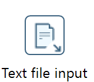

# Tipps für die Verwendung von Pentaho-Input-Funktionen

## Dokumentation

Die Dokumentation der Community Edition ist zu finden unter:  
https://pentaho-public.atlassian.net/wiki/spaces/EAI/overview 

## Manuelle Erfassung von Werten in einem Grid

Für die manuelle Erfassung von Werten bietet sich das DataGrid (Input) an. Es dient dazu, Werte inklusive der Datendefinitionen manuell zu erfassen.

## Text File Input -- CSV-Dateien laden mit Text File Input

CSV-Dateien enthalten komma-separierte Werte. Statt des Kommas können auch Tabs verwendet werden. In PDI wird dazu **"Textfile" Input** verwendet. 

Alternativ können CSV-Dateien auch mit "CSV-File Input" geladen werden. Die Funktion ist aber weniger mächtig.  
Textfile Input kann auch verwendet werden, z.B. durch Angabe eines Verzeichnisses **mehrere Dateien in einem Schritt** zu laden. Die Auswahl der Dateien kann auch mit einem regulären Ausdruck erfolgen (s.unten).  

Es besteht auch die Möglichkeit, **Zip-Files**, die CSV-Dateien enthalten zu laden. Für das Laden gibt es für den Fall spezieller Archivformate auch eine Funktion zum Öffnen von speziellen Formaten.

## Filtern mit regulären Ausdrücken (regex)

Um z.B. Namen von Dateien zu bestimmen, die geladen werden sollen, können reguläre Ausdrücke verwendet werden.  
Diese können z.B. auf der folgenden Website konstruiert und gegen Text getestet werden: https://regex101.com/ 

## Excel-Dateien

Das Laden von Excel-Dateien kann zu Problemen führen, da Excel z.B. auch mit Zeilenumbrüchen arbeitet (ALT-RETURN), die schwer durch Pentaho zu verarbeiten sind.  
Auch die Darstellung von Datumswerten stellt ein häufiges Problem dar. Es sollte daher, wenn möglich vermieden werden, mit Excel zu arbeiten und stattdessen vorab aus Excel eine CSV-Datei erstellt werden.
PDI verfügt dennoch über eine Möglichkeit, Excel-Dateien zu laden. (Microsoft Excel Input).
