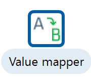
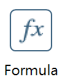

# Data Cleansing and Data Validation

## Data Cleansing

Hinweis: wenn in den folgenden Funktionen ein "Out (Stream) Field" gesetzt wird, wird eine neue Spalte erstellt.  

Bei der Bereinigung von Daten und zur Durchsetzung von Business Rules (Validation) können folgende Funktionen verwendet werden:

| Ziel der Bereinigung | PDI-Funktion |
|----------------------|------------|
| **vordefiniertes Format** sicherstellen oder wir müssen **Spalten löschen** | `Select values` |
| Zusammenfügen mehrerer Spalten in eine | `Concat fields`|
| Neue Werte zuweisen auf Basis einer Range, z.B. "Senior" basierend auf Alter zwischen 65 und 90 | `Number range`|
| Neuen Wert aufgrund eines alten Wertes (z.B. Korrektur von Länderinformationen "D" --> "Deutschland") | `Value mapper`|
| Duplikate entfernen | `Unique rows`|
| Spezielle Buchstaben löschen oder ändern | `Replace in String`| 
| Daten anhand einer Lookup-Tabelle prüfen | `Stream lookup` - füllt Daten gemäß Lookup auf. Falls nichts vorhanden, dann NULL.|
| analog | `Database lookup`|
| Zeilen aussortieren mittels Bedingung, z.B. NULL-Werte | `Filter rows`|
| Bedingungen mittels Formeln formulieren | z.B. `Calculator`|

### Value Mapper - Mapping von Source in Target Datenwerte

Wenn in Daten falsche Werte erfast sind, können diese z.B. durch einen Lookup in einer Mapping-Tabelle korrigiert werden. 
So kann es sein, dass für ein Land das Kürzel "D" oder "BRD" erfasst wurde, obwohl der korrekte Wert auf "Deutschland" gesetzt sein sollte.

Die Verarbeitung kann durch `Transform --> Value mapper` definiert werden.  

Problematisch dabei ist, das Value Mapper nur bei einer geringen Anzahl von Werten sinnvoll eingesetzt werden kann.

### String-Substitution

Mit `Transform --> Replace in String` können z.B. mittels RegEx oder Buchstabenersetzung Korrekturen an Daten vorgenommen werden.

### Fuzzy Match mit Lookup-Tabellenwerten

Schritte:

1) Lookup-Werte als Excel-Tabelle (Sheet) laden und das Feld laden, in dem die Lookup-Daten enthalten sind.  
2) Anschließend im `Lookup Step`von `Fuzzy Match` das Feld selektieren.  

3) Im Feld `Main stream field` das zu korrigerende Feld angeben.
4) Algorithmus z.B. Levenshtein und Maximal value = 2 und im Tab Fields "Get Fields" klicken. Andere Algorithmen können unter folgendem Link nachgelesen werden: https://pentaho-public.atlassian.net/wiki/spaces/EAI/pages/388310481/Fuzzy+match
5) Als Ergebnis entstehen weitere Spalten, die dann mit dem `Transform --> Select values` weggeschnitten werden müssen.

### Formula-Funktion - Daten mit Formeln berechnen

Hinweis: Es gibt auch eine Calculator-Funktion, die jedoch weniger mächtig ist.  

Formeln können eingefügt werden über `Scripting --> Formula`

Felder werden in eckigen Klammer in den Formeln verwendet.  
Z.B. [DISCOUNT] * 100

## Data Validation

Im Gegensatz zum Data Cleansing, dient Data Validation der Prüfung, ob Daten den Business Rules entsprechen.  

* So gibt es bspw. Standards für spezifische Daten (Währungs-Codes, IBAN, ...)  
* Auch Konsistenzbedingungen zwischen Tabellen fallen unter den Bereich Validation. Z.B. "Ist die Kundennummer aus der Transaktion auch in der Kundendatenbank enthalten?" --> Lookup

Wenn Zeilen den Validation Rules nicht entsprechen (Error Rows), dann kann folgends passieren:

1) Löschen der Error Rows
2) Trennung und Nachverarbeitung der Error Rows und Einfügen in die Verarbeitung
3) Logging der Error Rows
4) Schreiben der Error Rows, z.B. in eine Datei, um eine manuelle Prüfung zu unterstützen.

Mit der `Select values`-Funktion können wir Datentypen ändern
