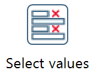
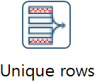
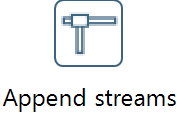

# Verarbeitungslogik in PDI

## Merging - Datenquellen miteinander verbinden

Merging bedeutet, dass Daten kombiniert werden.  

### Sorted Merge und Select Values

Vor eineme Sorted Merge müssen die einzelnen Datenstreams nach einem Attribut sortiert werden. I.d.R. ist das der Key.  

Das Vorgehen ist wie folgt:

1) Daten laden und beim Laden **deduplizieren** (anhand des Keys).
2) Gegebenenfallss mit  `Transform --> Select values` die Reihenfolge der Spalten einzelner Inputs anpassen, damit alle Inputs dasselbe Datenschema haben. 
Auch Daten(typ)konvertierungen können mit dieser Funktion implementiert werden.
3) Daten sortieren mit `Transform --> Sort rows`  
4) Daten mit `Joins --> Sorted merge` zusammenführen.
5) Zum Schluss wird das Ergebnis mit `Transform --> Unique rows` erneut dedupliziert.

### Append - Zusammenfügen von 2 Streams mittels "Anfügen"

Wenn 2 Streams vorher sortiert wurden und klar ist, dass die Streams sich nicht hinsichtlich ihrer Keys überlappen, können Daten auch mittels `Flow --> Append streams` zusammengefügt werden.

### Select values -  Hinweise zum Sortieren von Daten(spalten)

Mit  `Transform --> Select values` können  

1) Datenspalten ausgewählt werden,  
2) Datenspalten in der Reihenfolge geändert werden und
3) Daten(typ)konvertierungen implementiert werden.

