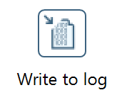

# Fehlerbehandlung

## Wertkorrektur

Vorgehen bei falschen Werten:

1) Neuen Wert aus Spalte X berechnen und in eine neue Spalte X1 legen  
2) Mit `Select values` die neu berechneten Werte aus X1 in die alte Spalte X überschreiben.
3) Anschließend die korrigierten Werte mit einem `Sorted merge` wieder in den Stream bringen. 

## Ins Log schreiben

Hierzu kann der `Write to log`-Step aus dem Bereich Utility verwendet werden.  

## Error in ein File schreiben

`Microsoft Excel output`
