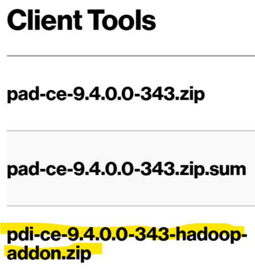

# Installation Pentaho Data Integration

Die Installationsschritte sind auch unter folgendem Link zu finden: https://www.hitachivantara.com/en-us/pdf/implementation-guide/three-steps-to-install-pentaho-data-integration-ce.pdf

Zur Installation der Pentaho Data Integration Suite sind folgende Schritte notwendig:
1) Installation von Java, falls noch nicht auf dem PC installiert. Es darf **maximal Version 11 des JDK** installiert werden!
2) Installation von Pentaho, hier Version 9.4

## Java-Installation prüfen

Öffnen Sie das Command-Fenster unter Windows und prüfen Sie Ihre Java-Version mit dem folgenden Befehl:

`java --version`

Falls Ihre Java-Version sehr veraltet ist, laden Sie bitte eine aktuelle Version herunter und installieren Sie diese.

## Laden Sie sich die Pentaho Data Integration Community Edition herunter

* Die Pentaho-Software finden Sie unter: [Link](https://sourceforge.net/projects/pentaho/)
* Der Link verweist auf die Website von Hitachi.
Bitte achten Sie darauf, die Community-Edition herunterzuladen.
* Nach dem Download der Zip-Datei, kopieren Sie diese bitte in einen Ordner, auf den Sie Zugriff haben. Entzippen Sie anschließend die Datei. 
  * Es bietet sich an, die Datei im Benutzerprofil zu extrahieren.  
  * Die grafische Benutzeroberfläche finden Sie nun als Windows-Batch-Datei unter dem Namen **spoon.exe**
  * Erstellen Sie sich einen Link zu dieser Datei auf Ihrem Desktop. Dazu Rechtsklick --> An Desktop senden  
  * Sie können im Anschluss das Icon ändern (Rechtsklick) und z.B. das Icon aus dem Installationspfad verwenden.
Falls Spoon nicht ausgeführt wird, öffnen Sie bitte SpoonDebug, um den Fehler zu identifizieren.

Pentaho sollte nun starten und nach einem Lade-Bildschirm die Anwendung anzeigen:

## Marketplace nachinstallieren

Der Marketplace ist leider nicht mehr in der Community Edition enthalten. Er kann aber über das Hadoop-Plugin nachinstalliert werden.  
Die Installationsanweisung befindet sich hier:  

* [Link zur Installationsanleitung](https://www.hitachivantara.com/en-us/pdf/implementation-guide/three-steps-to-install-pentaho-data-integration-ce.pdf)  
* Sie müssen unbedingt das erste Paket, wie in der folgenden Abbildung dargestellt, herunter laden.

Dieses müssen Sie anschließend entpacken und die Inhalte aus "dataintegration" nach "dataintegration" in ihrem Installationspfad der PDI kopieren.

