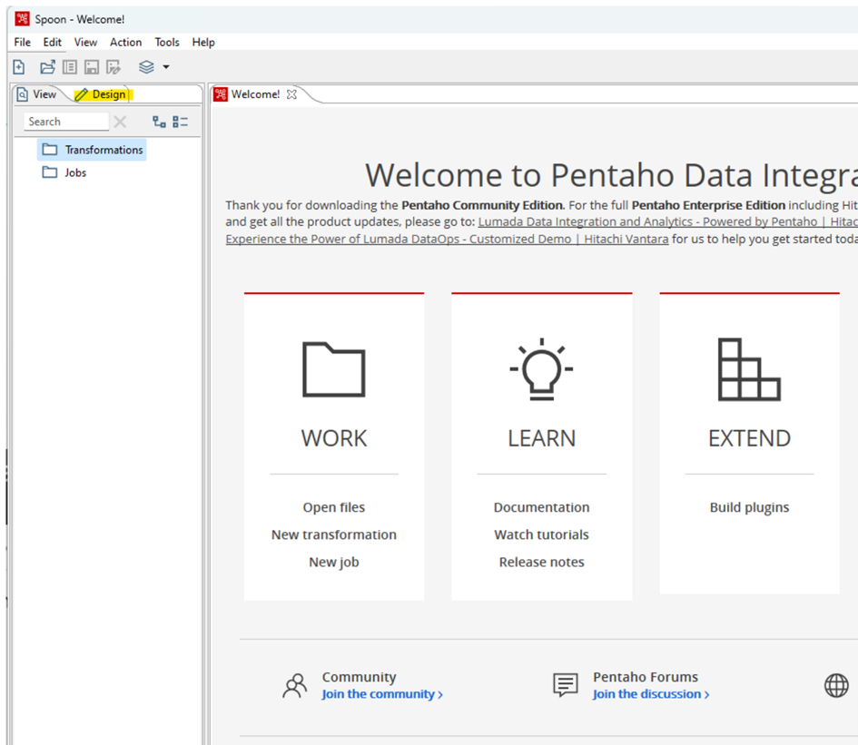

# Installation Pentaho Data Integration

## Herunterladen der Anwendungspakete

Versionsnummer von Pentaho Data Integration: 10.2.
Die freie Version der Software entspricht der Developer Version und ist nach Registrierung unter der Website herunterzuladen.  

[https://pentaho.com/products/pentaho-data-integration/](https://pentaho.com/products/pentaho-data-integration/)

Dort auf "Licensing Options" klicken und die Developer Version herunterladen:

Bitte laden Sie die beiden folgenden Pakete herunter:

* Basis-Installation: `pdi-ce-10.2.0.0-222`
* Hadoop-Add-On: `pdi-ce-10.2.0.0-222-hadoop-addon`

Zur Installation der Pentaho Data Integration Suite sind folgende Schritte notwendig:

## Installation von Java, falls noch nicht auf dem PC installiert.  

Hinweis: für die Vorversion (Pentaho 9.4) darf **maximal Version 11 des JDK** installiert werden! Bei der Version 10.2. gilt diese Einschränkung nicht mehr.  

**Java-Installation prüfen:** Öffnen Sie das Command-Fenster unter Windows und prüfen Sie Ihre Java-Version mit dem folgenden Befehl:
`java --version`

Eventuell müssen Sie die JAVA_HOME Umgebungsvariable noch auf die aktuelle Java-Version setzen. Diese finden Sie in den Windows-Umgebungsvariablen:  

## Installation von Pentaho Base

* Kopieren Sie die Zip-Datei der Basis-Installation: `pdi-ce-10.2.0.0-222` in einen Ordner, auf den Sie Zugriff haben. Entzippen Sie anschließend die Datei.  
* Es bietet sich an, die Datei im Benutzerprofil zu extrahieren.  
* Die grafische Benutzeroberfläche können Sie nun mittels einer Windows-Batch-Datei mit dem Namen **spoon.exe** starten.
* Erstellen Sie sich auch einen Link zu dieser Datei auf Ihrem Desktop. Dazu Rechtsklick --> An Desktop senden  
* Sie können im Anschluss das Icon ändern (Rechtsklick --> Eigenschaften) und z.B. das Icon aus dem Installationspfad verwenden -->

Falls Spoon nicht ausgeführt wird, öffnen Sie `SpoonDebug`, um den Fehler zu identifizieren.

Pentaho sollte nun starten und nach einem Lade-Bildschirm die Anwendung anzeigen:

## Pentaho Marketplace nachinstallieren

Der Marketplace ist nicht mehr in der Developer Edition enthalten. Er kann aber über das Hadoop-Plugin nachinstalliert werden. Das Plugin haben Sie oben bereits heruntergeladen.
Die Installationsanweisung befindet sich [hier](https://www.hitachivantara.com/en-us/pdf/implementation-guide/three-steps-to-install-pentaho-data-integration-ce.pdf)  

Über den Marketplace können Erweiterungen geladen werden.  

## MySQL-Plugin

Um auf MySQL zugreifen zu können, war in der Version 9.4 noch die Installation eines Plugins notwendig. Sollte die MySQL-Integration nicht funktionieren, laden Sie den entsprechenden J-Connector und suchen Sie im Internet nach einer Installationsanleitung.  

Alternativ können Sie auch die folgende (etwas veraltete) Datei öffnen: [MySQL-Installation](./Pentaho_MySQL_Treiber.md)
