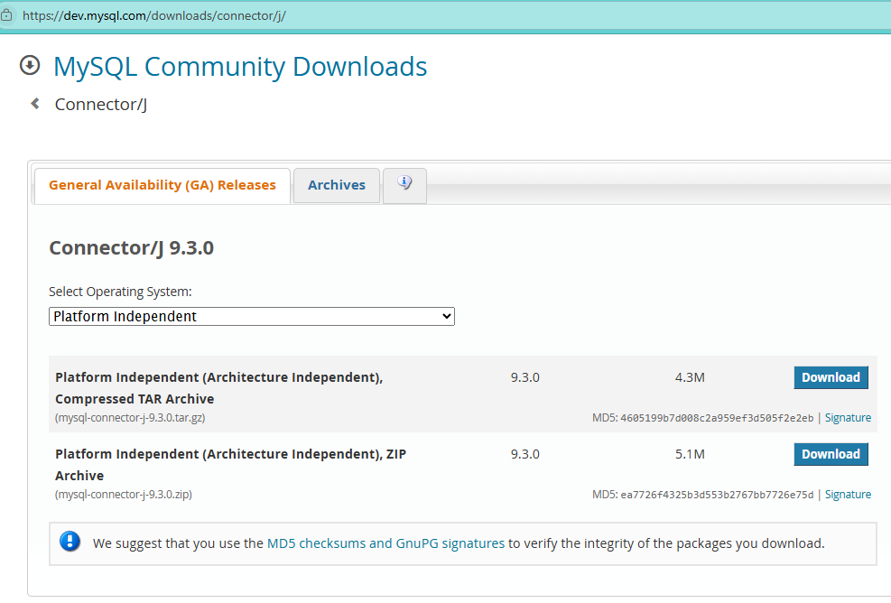
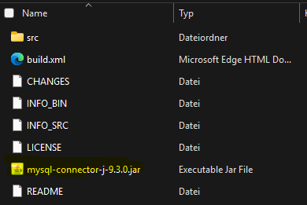

# Installation der MySQL-Integration in PDI

Schritte:

1) Connector/J in letzter Version herunterladen. [Download](https://dev.mysql.com/downloads/connector/j/) und die enthaltene jar-Datei in den Ordner lib kopieren.  

2. Den Marketplace installieren: [Installation Pentaho](Pentaho%20Data%20Integration.md)
3. In Pentaho Marketplace öffnen --> Tools --> MySQL Plugin installieren
